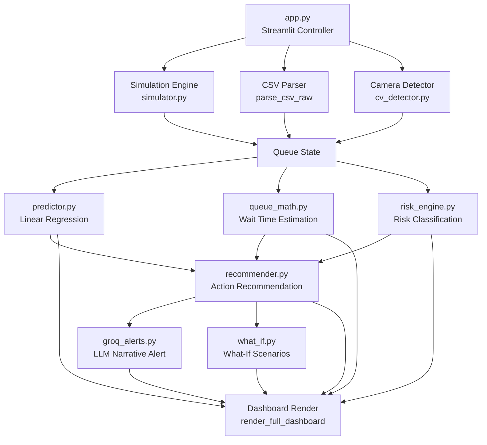
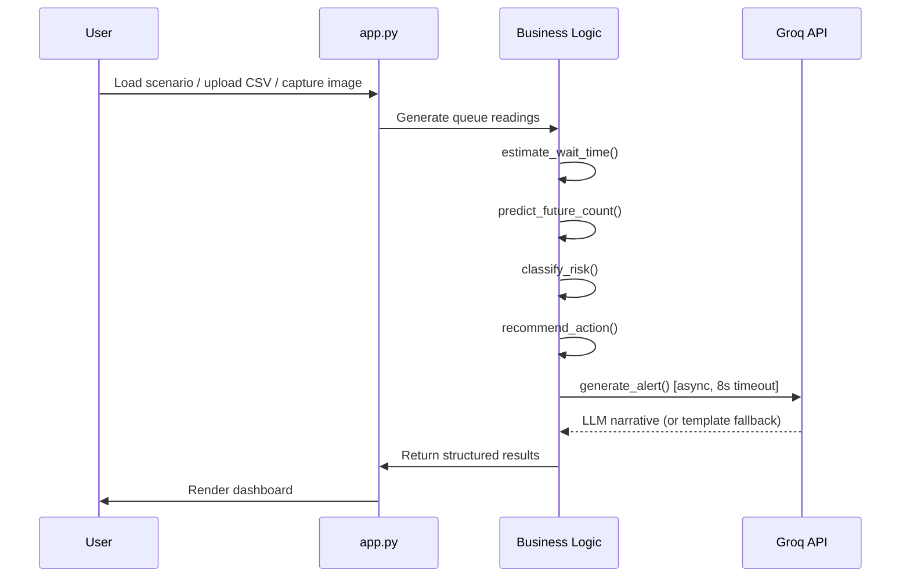

# QueueIQ

**Queue Intelligence Platform** — Real-time AI-powered queue monitoring, forecasting, and operational intelligence for enterprise service environments.

[](https://python.org)
[](https://streamlit.io)
[](https://ultralytics.com)
[](https://groq.com)
[](LICENSE)

---

## Table of Contents

- [Product Vision](#product-vision)
- [Core Features](#core-features)
- [Architecture](#architecture)
- [Data Flow](#data-flow)
- [Technology Stack](#technology-stack)
- [Project Structure](#project-structure)
- [Installation](#installation)
- [Environment Variables](#environment-variables)
- [Local Development](#local-development)
- [Operating Modes](#operating-modes)
- [Simulation](#simulation)
- [Data Upload](#data-upload)
- [Camera / Vision](#camera--vision)
- [Forecasting](#forecasting)
- [AI Alerts](#ai-alerts)
- [UI/UX Principles](#uiux-principles)
- [Light and Dark Mode](#light-and-dark-mode)
- [Production Deployment](#production-deployment)
- [Security](#security)
- [Accessibility](#accessibility)
- [Roadmap](#roadmap)
- [Contributing](#contributing)
- [License](#license)

---

## Product Vision

QueueIQ answers five operational questions within seconds:

| # | Question | Answer Source |
|---|----------|--------------|
| 1 | What is happening now? | Live counter readings |
| 2 | Is there a problem? | Risk classifier |
| 3 | What will happen next? | Linear regression forecast |
| 4 | Why? | Arrival vs. service rate analysis |
| 5 | What should I do? | Recommendation engine |

Designed for **banking counters**, **government service centers**, **airports**, **hospitals**, and **retail service environments** where queue management directly impacts customer experience and operational efficiency.

---

## Core Features

| Feature | Description |
|---------|-------------|
| **Simulation** | Poisson-based multi-counter queue simulation with demographic presets |
| **CSV Upload** | Import historical or live queue data for instant AI analysis |
| **Camera / Vision** | YOLOv8n person detection on uploaded images and video footage |
| **Live Camera** | Real-time webcam capture with AI people counting and CSV export |
| **AI Forecasting** | Linear regression with multi-horizon predictions (+5/+10/+15/+20 min) |
| **Risk Classification** | Per-counter and facility-level risk scoring (Normal → Critical) |
| **Recommendations** | Actionable guidance: redirect, open counter, increase service rate |
| **Groq LLM Alerts** | Natural language operational alerts via llama-3.3-70b-versatile |
| **M/M/1 Queuing** | Theoretical wait-time estimation using queuing theory |
| **What-If Simulator** | Model impact of interventions before acting |
| **Dark / Light Mode** | Independently designed, semantically tokenized themes |

---

## Architecture



### Single-File Controller Pattern

`app.py` is the single application controller. It:
1. Manages all Streamlit session state
2. Routes between three data modes
3. Calls business logic modules
4. Renders the UI through pure functions

Business logic is isolated in independent modules with no Streamlit imports — they are independently testable.

---

## Data Flow



---

## Technology Stack

| Layer | Technology | Purpose |
|-------|-----------|---------|
| Framework | Streamlit 1.35+ | Web application server |
| Language | Python 3.11+ | Application runtime |
| ML — Vision | YOLOv8n (ultralytics) | Person detection |
| ML — Forecast | scikit-learn LinearRegression | Queue count prediction |
| LLM | Groq (llama-3.3-70b-versatile) | Natural language alerts |
| Data | pandas, numpy | Data processing |
| Charts | Altair (Vega-Lite) | Theme-aware visualizations |
| Styling | Semantic CSS tokens | Design system |
| Typography | Inter + JetBrains Mono | UI + data fonts |
| Deployment | Streamlit Community Cloud | Primary target |
| Container | Docker | Railway / Render / Fly.io |

---

## Project Structure

```
queue-predictor/
├── app.py                  # Main application controller (1,985 lines)
├── simulator.py            # Poisson queue simulation engine
├── predictor.py            # Linear regression forecaster
├── recommender.py          # Action recommendation engine
├── risk_engine.py          # Risk classification (Normal → Critical)
├── queue_math.py           # Wait time + M/M/1 queueing theory
├── groq_alerts.py          # Groq LLM alert generation with fallback
├── what_if.py              # What-if scenario calculator
├── cv_detector.py          # YOLOv8 person detection pipeline
├── config.py               # Application constants
│
├── requirements.txt        # Python dependencies
├── Dockerfile              # Container deployment
├── .dockerignore           # Docker build exclusions
├── .env.example            # Environment variable template
├── .gitignore              # Git exclusions (secrets never committed)
├── README.md               # This file
│
├── .streamlit/
│   ├── config.toml         # Streamlit server configuration (committed)
│   ├── secrets.toml        # Local secrets (gitignored — never commit)
│   └── secrets.toml.example  # Secrets template
│
└── tests/
    └── ...                 # Test suite
```

---

## Installation

### Prerequisites

- Python 3.11 or later
- pip

### Steps

```bash
# 1. Clone the repository
git clone https://github.com/YOUR_USERNAME/queueiq.git
cd queueiq/queue-predictor

# 2. Create and activate a virtual environment
python -m venv .venv

# Windows
.venv\Scripts\activate

# macOS / Linux
source .venv/bin/activate

# 3. Install dependencies
pip install -r requirements.txt

# 4. Configure environment variables
cp .env.example .env
# Edit .env — add your GROQ_API_KEY (optional)

# 5. Start the application
python -m streamlit run app.py
```

Open **http://localhost:8501** — Password: `queueiq2024`

---

## Environment Variables

| Variable | Required | Default | Description |
|----------|----------|---------|-------------|
| `GROQ_API_KEY` | Optional | — | Groq LLM key for AI narrative alerts. If absent, the app generates template-based alerts automatically. Get a free key at [console.groq.com](https://console.groq.com/keys). |

> **Security**: `GROQ_API_KEY` is a **server-side secret**. Never expose it in client-side code or commit it to Git.

See [`.env.example`](.env.example) for the complete template.

---

## Local Development

```bash
# Run in development mode (hot-reload enabled by default in Streamlit)
python -m streamlit run app.py

# Check syntax
python -c "import ast; ast.parse(open('app.py', encoding='utf-8').read()); print('Syntax OK')"

# Test Groq integration
python groq_alerts.py

# Run tests
python -m pytest tests/ -v
```

---

## Operating Modes

QueueIQ has three data modes, all rendering through the same dashboard pipeline:

### Mode Selection

Select the data source from the **sidebar** under **Data Source**:

| Mode | Sidebar Label | Data Source |
|------|--------------|-------------|
| Simulation | 🔁 Simulation | Real-time Poisson generator |
| Upload CSV | 📂 Upload CSV | Historical CSV file |
| Camera / Vision | 📹 Camera / Vision | YOLOv8 image/video analysis |

---

## Simulation

The simulation engine uses a **Poisson process** to model realistic queue behavior:

- Configurable arrival rate (customers/minute)
- Per-counter service rates
- Location presets: Bank, Airport, Hospital, Retail
- 1–6 counters
- Configurable tick speed (1–10 seconds per step)

**Demo scenarios:**

| Scenario | Description |
|----------|-------------|
| Normal (low traffic) | Steady low-load baseline |
| Rush Hour | All counters under significant load |
| Sudden Surge | One counter overwhelmed, others idle |
| Counter Failure | Reduced counter count, high load |
| All Clear | All counters at minimal load |

**Controls** in the sidebar:
- **Queue Setup**: location preset + counter count
- **Scenarios**: pre-built load scenarios
- **Playback**: step-by-step or auto-play at configurable speed
- **Prediction Settings**: forecast horizon + alert threshold

---

## Data Upload

Upload operational queue data as a CSV file.

### Required CSV Format

| Column | Type | Description |
|--------|------|-------------|
| `timestamp` | datetime | Reading timestamp (any parseable format) |
| `counter_name` | string | Counter identifier (e.g. "Counter 1 (Main)") |
| `people_count` | integer | Number of people in queue at this timestamp |

### Example

```csv
timestamp,counter_name,people_count
2024-01-15 09:00:00,Counter 1 (Main),12
2024-01-15 09:00:00,Counter 2 (Express),4
2024-01-15 09:05:00,Counter 1 (Main),15
2024-01-15 09:05:00,Counter 2 (Express),3
```

A **sample CSV** (3 counters × 49 readings) is available in the sidebar as a download.

---

## Camera / Vision

The camera module uses **YOLOv8n** (nano model, ~6 MB) for person detection.

> **YOLOv8 is optional.** If unavailable, the app gracefully falls back to Simulation Mode.

### Footage Upload

1. Upload one file per counter (JPEG, PNG, MP4, AVI, MOV)
2. Name each counter
3. AI detects and counts people in each file
4. Results feed the full analysis pipeline

### Live Camera

1. Point your camera at a queue
2. Click **Take Photo**
3. Click **Detect & Record**
4. AI counts people and records the timestamp
5. Build a time-series by capturing multiple frames
6. Export as CSV for full analysis

### Notes

- CCTV mode processes **uploaded footage** — it is not a live stream processor
- Live camera uses the browser's `getUserMedia` API (HTTPS required in production)
- YOLOv8n weights (~6 MB) are auto-downloaded on first use

---

## Forecasting

QueueIQ generates forecasts using **linear regression** over recent readings.

### Single-Horizon Forecast

Predicts the queue count at a configurable horizon (5–60 minutes ahead).

### Multi-Horizon Forecast

Predicts at four fixed horizons simultaneously: **+5m / +10m / +15m / +20m**

Each prediction includes:
- Point estimate
- Confidence interval [low–high]
- Trend slope (people/minute)
- Forecast method (regression / extrapolation / fallback)

Minimum readings required before forecasting: **5 per counter** (configurable in `config.py`).

---

## AI Alerts

QueueIQ generates natural language operational alerts using **Groq's LLaMA 3.3 70B** model.

### Alert Generation Pipeline

```
Counter readings + predictions + recommendation
        ↓
Compact system-state prompt
        ↓
Groq API (llama-3.3-70b-versatile, max 80 tokens)
        ↓
One-sentence operational alert for the manager
```

### Offline Fallback

If the Groq API is unavailable (no key, network error, timeout), the system falls back to a **deterministic template-based alert** — the application never breaks.

```python
# From groq_alerts.py — fallback example:
"[Auto-alert] Counter 3 (Loans) currently has 21 people
 and is projected to reach 40 in 20 minutes — redirect
 customers to a less busy counter."
```

---

## UI/UX Principles

QueueIQ is designed as a **modern intelligent operations control center**, not a marketing dashboard.

### Information Hierarchy

Every page follows a consistent structure:

```
Page Header (where am I, what mode, current time)
        ↓
Status Bar (facility health at a glance)
        ↓
Operational Intelligence (4 questions answered)
        ↓
Counter Cards (per-counter detail)
        ↓
Forecast Chart (trend visualization)
        ↓
Action Intelligence (recommendation + AI alert)
        ↓
Detailed Analysis (expandable — M/M/1, What-If, Multi-Horizon)
```

### Design System

- **Color tokens**: All surfaces and text use semantic CSS variables — no hardcoded hex values
- **Typography**: Inter (UI text) + JetBrains Mono (data/metrics) from Google Fonts
- **Spacing**: 4·8·12·16·20·24·32·40·48·64px scale
- **Border radius**: 3/5/7/10px — restrained, not giant rounded rectangles
- **Elevation**: Flat by default, subtle shadow on raised surfaces only
- **Icons**: Minimal Unicode symbols — no emoji in operational UI

---

## Light and Dark Mode

Both themes are **independently designed** and use a shared semantic token system:

```css
/* Shared token names — values differ per theme */
--bg-base         --surface          --text-primary
--bg-secondary    --surface-raised   --text-secondary
--border          --accent           --success
--border-strong   --accent-muted     --warning / --danger
```

### Theme Architecture

- `inject_theme(theme)` swaps all `:root` token values at runtime
- Charts (Altair/Vega-Lite) receive per-render color configuration via `_chart_tc(theme)`
- **Sidebar stays dark in light mode** — intentional contrast anchor (Linear/Vercel pattern)
- No component has hardcoded colors — all consume `var(--token)`

Toggle between themes using the ☀️/🌙 button in the sidebar header.

---

## Production Deployment

### ⭐ Streamlit Community Cloud (Primary — Free)

> **Note on Vercel**: Streamlit requires a persistent ASGI server. Vercel's serverless architecture does not support this. Use Streamlit Community Cloud, Railway, or Docker-based hosts instead.

```bash
# 1. Push to GitHub
git init && git add . && git commit -m "QueueIQ production release"
git remote add origin https://github.com/YOUR_USERNAME/queueiq
git push -u origin main

# 2. Deploy
# Go to https://share.streamlit.io
# New app → select repo → Main file: queue-predictor/app.py
# Advanced settings → Secrets → paste:
#   GROQ_API_KEY = "your_key_here"
# Click Deploy
```

Live in ~2 minutes at `https://your-app.streamlit.app`

### Railway

```bash
# Connect GitHub repo at railway.app
# Set environment variable: GROQ_API_KEY=your_key
# Deploy — Railway auto-detects Python
```

### Docker (Render / Fly.io / Google Cloud Run)

```bash
docker build -t queueiq .
docker run -p 8501:8501 -e GROQ_API_KEY=your_key queueiq
```

Open http://localhost:8501

---

## Security

| Concern | Implementation |
|---------|---------------|
| API key storage | `.env` (local) or Streamlit Secrets (cloud) — never in code |
| Git exclusions | `.env`, `secrets.toml`, `*.pt` weights in `.gitignore` |
| XSRF protection | Enabled in `.streamlit/config.toml` |
| Auth gate | Session-based password check before any UI renders |
| No client-side secrets | Groq API called server-side only via `groq_alerts.py` |
| Key rotation | Rotate at [console.groq.com/keys](https://console.groq.com/keys) if exposed |

**Never commit:**
- `.env`
- `.streamlit/secrets.toml`
- `*.pt` model weights (auto-downloaded at runtime)

---

## Accessibility

- Semantic HTML structure throughout
- Keyboard-navigable sidebar and controls
- Color is never the **only** indicator of state (badges include text labels)
- Sufficient contrast in both dark and light themes (WCAG AA target)
- `prefers-reduced-motion` media query disables animations system-wide
- All form inputs have explicit labels
- ARIA attributes on interactive custom components

---

## Roadmap

| Priority | Feature |
|----------|---------|
| High | Real-time WebSocket counter integration |
| High | PostgreSQL persistence for historical data |
| High | Multi-facility workspace support |
| Medium | RTSP/IP camera stream support |
| Medium | Alert notification delivery (email, Slack, webhook) |
| Medium | Shift scheduling recommendations |
| Medium | Custom threshold rules per counter |
| Low | Mobile-optimized PWA experience |
| Low | Role-based access (admin / operator / viewer) |
| Low | Audit log |

---

## Contributing

1. Fork the repository
2. Create a feature branch: `git checkout -b feat/your-feature`
3. Follow the existing code conventions in `app.py` (pure render functions, no logic in render layer)
4. Add tests for any business logic changes in `tests/`
5. Ensure both light and dark themes work visually
6. Submit a pull request with a clear description

Business logic modules (`predictor.py`, `recommender.py`, `risk_engine.py`, etc.) have no Streamlit imports — keep it that way for testability.

---

## License

MIT — see [LICENSE](LICENSE) for details.

---

<div align="center">
  <strong>QueueIQ</strong> · Queue Intelligence Platform<br>
  Built for enterprise operations · Powered by AI
</div>
